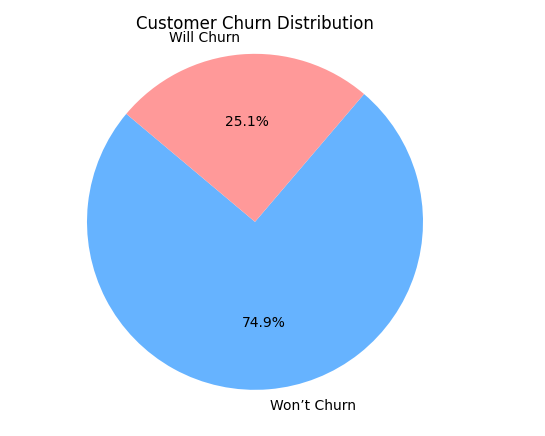

# 🧠 Customer Churn Prediction Using Machine Learning

This project predicts customer churn for a telecom company using a Random Forest classifier. It walks through the full data science workflow, from data preprocessing and exploratory data analysis (EDA) to machine learning model training, evaluation, and visualization. The goal is to identify customers who are likely to leave so the business can take proactive steps to retain them.

---

## 📁 Project Structure


---

## 🚀 Features

- Clean and preprocess telecom customer data
- Visualize churn trends with Seaborn and Matplotlib
- Train a Random Forest classifier to predict churn
- Evaluate model using classification report, confusion matrix, and ROC AUC
- Export list of customers likely to churn
- Ready for dashboard integration (Power BI / Looker Studio)

---

## 📊 Dataset

- **Source**: [Telco Customer Churn – Kaggle](https://www.kaggle.com/blastchar/telco-customer-churn)
- Contains customer account data like tenure, contract type, internet service, and churn status.

---

## 📈 Example Visualizations

| Chart | Description |
|-------|-------------|
|  | Churn vs. Non-Churn Distribution |
|  | Churn by Contract Type |

---

## 🧪 How to Run

1. Clone the repository
2. Install dependencies:
   ```bash
   pip install -r requirements.txt
